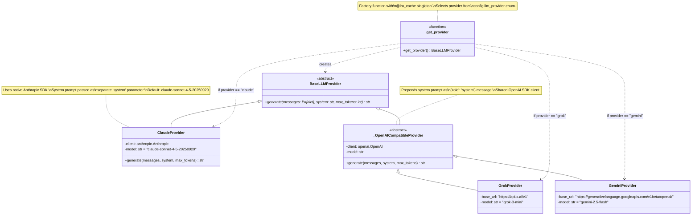
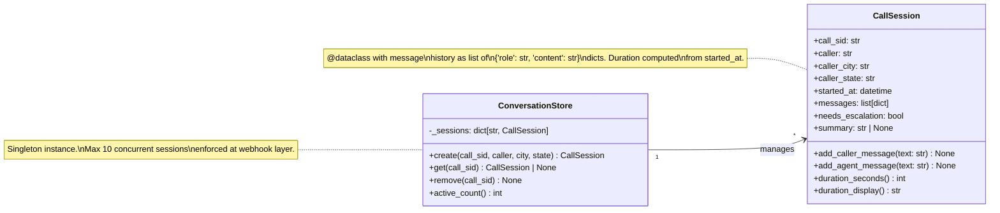
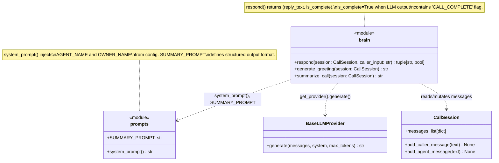
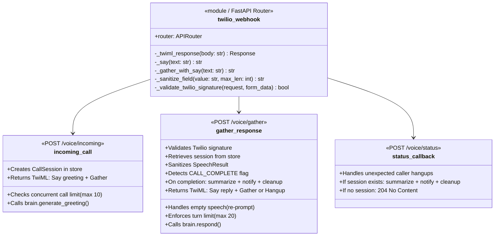
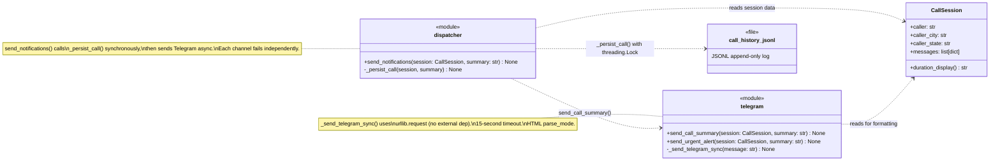

# C4 Level 4: Code Diagram

Module and class-level detail for the key subsystems.

## LLM Provider Subsystem

## Session State Model

## Conversation Brain

## Webhook Request Handler

## Notification Pipeline

