# C4 Level 3: Component Diagram

The internal components of the FastAPI application and how they interact.

```mermaid
C4Component
    title Component Diagram - PDAgent FastAPI Application

    Container_Boundary(app, "FastAPI Application") {

        Component(main, "Application Bootstrap", "main.py", "FastAPI app factory, lifespan management, middleware registration, health endpoint")

        Component(config, "Configuration", "config.py", "Pydantic Settings with env var loading, provider-specific API key validation")

        Component_Ext(middleware_rate, "Rate Limiter", "security.py", "Sliding window rate limiter, 30 req/min per IP on /voice/* endpoints")

        Component_Ext(middleware_sec, "Security Headers", "security.py", "CSP, X-Frame-Options, X-Content-Type-Options, Referrer-Policy")

        Component(webhook, "Twilio Webhook Handler", "voice/twilio_webhook.py", "TwiML response generation, signature validation, session lifecycle, turn management")

        Component(brain, "Conversation Brain", "agent/brain.py", "Orchestrates LLM calls for greeting, response, and summary generation")

        Component(prompts, "Prompt Templates", "agent/prompts.py", "System prompt with personality, rules, security directives; summary prompt template")

        Component(llm, "LLM Provider", "agent/llm.py", "Abstract provider with Claude, Grok, Gemini implementations; factory pattern")

        Component(store, "Conversation Store", "store/conversations.py", "In-memory CallSession management with create/get/remove/active_count")

        Component(dispatcher, "Notification Dispatcher", "notifications/dispatcher.py", "Routes completed calls to persistence and notification channels")

        Component(telegram, "Telegram Notifier", "notifications/telegram.py", "Formats and sends HTML call reports via Telegram Bot API")

        Component(cleanup, "Session Cleanup", "security.py", "Background asyncio task removing stale sessions every 5 minutes")
    }

    System_Ext(twilio_ext, "Twilio", "Voice Platform")
    System_Ext(llm_ext, "LLM API", "Claude / Grok / Gemini")
    System_Ext(telegram_ext, "Telegram", "Bot API")
    ContainerDb(calllog, "call_history.jsonl", "JSONL file")

    Rel(twilio_ext, webhook, "POST webhooks", "HTTPS")
    Rel(webhook, twilio_ext, "TwiML XML")

    Rel(main, config, "Reads configuration")
    Rel(main, middleware_rate, "Registers middleware")
    Rel(main, middleware_sec, "Registers middleware")
    Rel(main, cleanup, "Starts background task on lifespan")

    Rel(webhook, store, "Create / Get / Remove sessions")
    Rel(webhook, brain, "generate_greeting(), respond(), summarize_call()")
    Rel(webhook, dispatcher, "send_notifications() on call completion")

    Rel(brain, prompts, "system_prompt(), SUMMARY_PROMPT")
    Rel(brain, llm, "get_provider().generate()")
    Rel(llm, llm_ext, "HTTPS API call")

    Rel(dispatcher, calllog, "Append JSONL record (thread-safe)")
    Rel(dispatcher, telegram, "send_call_summary()")
    Rel(telegram, telegram_ext, "POST /sendMessage")

    Rel(cleanup, store, "Remove stale sessions")
```



## Component Responsibilities

### Request Processing Pipeline

```
Incoming Request
    |
    v
[Rate Limiter] ---(429 if exceeded)--->
    |
    v
[Security Headers] --- adds response headers --->
    |
    v
[Twilio Webhook Handler]
    |
    +--- Validates X-Twilio-Signature (403 if invalid)
    +--- Sanitizes input fields (truncate, strip)
    +--- Routes to endpoint handler
         |
         +--- /voice/incoming: Create session -> Generate greeting -> Return TwiML
         +--- /voice/gather:   Get session -> LLM respond -> Check CALL_COMPLETE -> Return TwiML
         +--- /voice/status:   Handle hangup -> Summarize -> Notify -> Clean up
```

### Component Interaction Matrix

| Source | Target | Method | Frequency |
|--------|--------|--------|-----------|
| Webhook -> Store | `create()`, `get()`, `remove()` | Every webhook request |
| Webhook -> Brain | `generate_greeting()` | Once per call |
| Webhook -> Brain | `respond()` | Every caller turn (up to 20) |
| Webhook -> Brain | `summarize_call()` | Once per call (on completion) |
| Webhook -> Dispatcher | `send_notifications()` | Once per call (on completion) |
| Brain -> LLM | `provider.generate()` | Every greeting + turn + summary |
| Brain -> Prompts | `system_prompt()` | Every LLM call |
| Dispatcher -> JSONL | File append | Once per call |
| Dispatcher -> Telegram | HTTP POST | Once per call |
| Cleanup -> Store | `remove()` | Every 5 min (only stale sessions) |

### Key Design Patterns

| Pattern | Where | Purpose |
|---------|-------|---------|
| **Factory** | `llm.get_provider()` | Creates provider instance based on config; cached singleton |
| **Strategy** | `BaseLLMProvider` subclasses | Swappable LLM backends with uniform interface |
| **Observer** | Notification dispatcher | Decouples call completion from notification delivery |
| **Template Method** | `_OpenAICompatibleProvider` | Base class handles OpenAI SDK; subclasses configure URL/model |
| **Middleware** | Rate limiter, security headers | Cross-cutting concerns separated from business logic |
