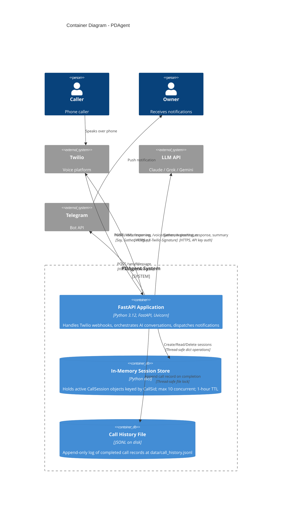

# C4 Level 2: Container Diagram

The internal containers (deployable units and data stores) that make up PDAgent.

## Container Details

### FastAPI Application

| Attribute | Value |
|-----------|-------|
| Runtime | Python 3.12, Uvicorn ASGI |
| Framework | FastAPI 0.115.6 |
| Endpoints | `POST /voice/incoming`, `POST /voice/gather`, `POST /voice/status`, `GET /health`, `GET /` |
| Middleware | RateLimitMiddleware (30 req/min), SecurityHeadersMiddleware (CSP, X-Frame-Options) |
| Background Tasks | Stale session cleanup (every 5 min, removes sessions > 1 hour old) |
| Deployment | Docker container, cloud PaaS, or bare EC2 + ngrok |

### In-Memory Session Store

| Attribute | Value |
|-----------|-------|
| Implementation | `dict[str, CallSession]` behind `ConversationStore` class |
| Capacity | Max 10 concurrent sessions (enforced at `/voice/incoming`) |
| TTL | 1 hour (background cleanup task) |
| Thread Safety | Standard Python dict (single-threaded asyncio event loop) |
| Durability | None - sessions lost on process restart |
| Session Data | CallSid, caller number, city/state, start time, message history, escalation flag, summary |

### Call History File

| Attribute | Value |
|-----------|-------|
| Format | JSON Lines (one JSON object per line) |
| Location | `data/call_history.jsonl` (configurable via `DATA_DIR` env var) |
| Thread Safety | `threading.Lock()` for file writes |
| Fields | call_sid, caller, caller_city, caller_state, started_at, duration_seconds, duration_display, summary, timestamp, turn_count |
| Size Limits | call_sid: 50 chars, caller: 200 chars, summary: 5000 chars |
| Docker | Mounted as volume at `/app/data` |

## Scaling Considerations

This architecture is designed for a **single-instance personal assistant** (1-2 concurrent calls typical). Scaling beyond a single instance would require:

1. **Session store** -> Redis or similar shared state store
2. **Call history** -> PostgreSQL or time-series database
3. **Load balancing** -> Sticky sessions or session-aware routing
4. **Twilio webhook URLs** -> Behind a load balancer with consistent routing
