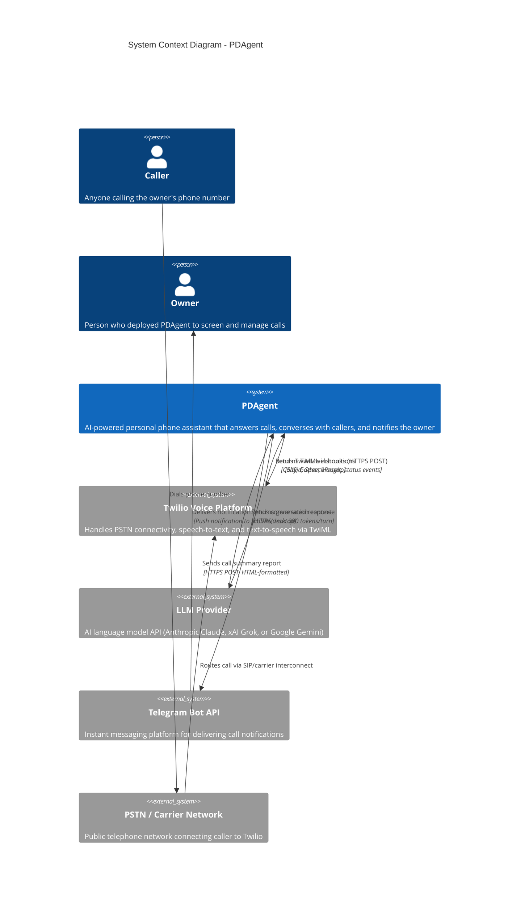

# C4 Level 1: System Context Diagram

How PDAgent fits into the broader ecosystem of users and external systems.

## Key Observations

- **PDAgent never directly communicates with the caller.** All voice interaction is mediated through Twilio, which handles speech recognition (ASR) and text-to-speech (TTS).
- **The owner does not interact with PDAgent during a call.** They receive a post-call summary via Telegram after the conversation concludes.
- **LLM calls are synchronous and blocking.** Each caller utterance triggers a round-trip to the LLM provider before Twilio can speak the response. This introduces latency in the conversation loop (see [data-flow.md](data-flow.md) for latency analysis).
- **Three external API dependencies** create three potential failure points. Twilio is the most critical; LLM failure results in a degraded experience; Telegram failure only affects notifications.

## Trust Boundaries

| Boundary | Inside | Outside |
|----------|--------|---------|
| PDAgent process | Session state, LLM prompts, call history | All external APIs |
| Twilio signature validation | Authenticated webhook requests | Unsigned/tampered requests (rejected 403) |
| Rate limiter | Requests within 30/min threshold | Excess requests (rejected 429) |
