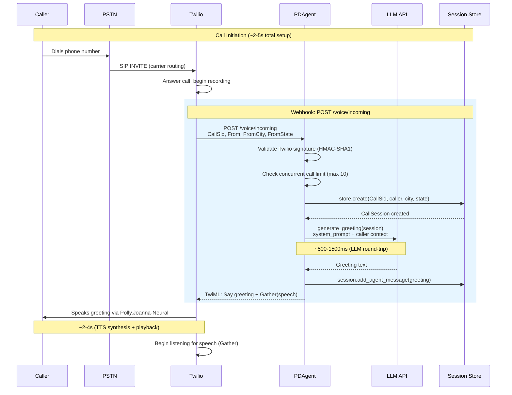
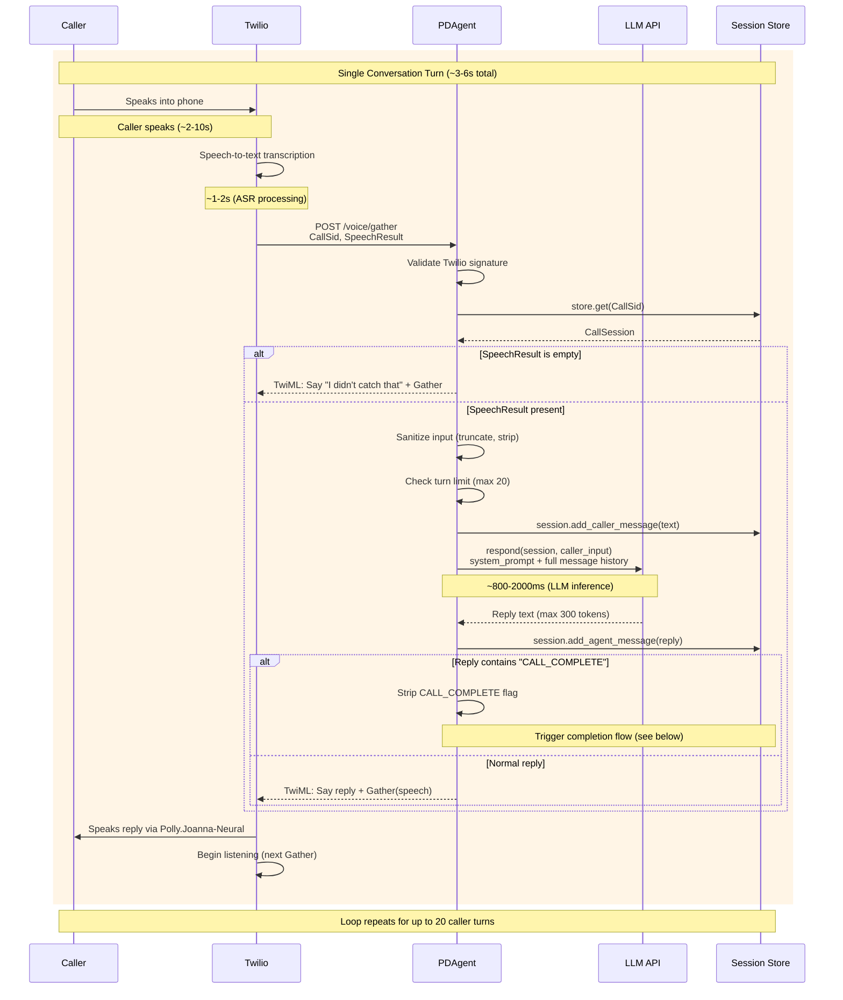
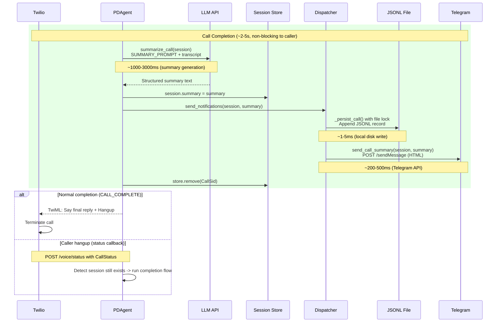
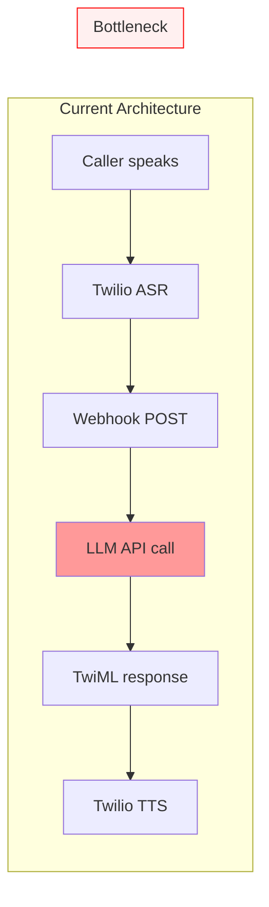
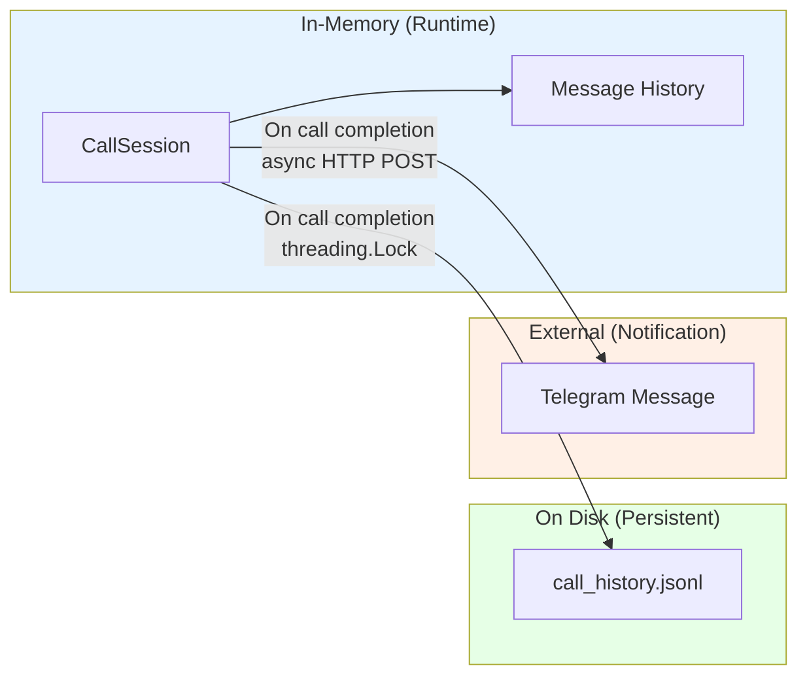

# Data Flow & Latency Analysis

End-to-end data flows through PDAgent with latency budget analysis.

## Incoming Call Flow

## Conversation Turn Flow

## Call Completion Flow

## Latency Budget Analysis

### Per-Turn Latency Breakdown

| Phase | Duration | Notes |
|-------|----------|-------|
| Caller speaks | 2-10s | Variable; depends on utterance length |
| Twilio ASR | 1-2s | Speech-to-text processing |
| Network (Twilio -> PDAgent) | 50-200ms | Depends on deployment location |
| Signature validation | <1ms | HMAC-SHA1 computation |
| Session lookup + sanitization | <1ms | In-memory dict lookup |
| LLM API round-trip | 800-2000ms | **Dominant latency source** |
| Network (PDAgent -> Twilio) | 50-200ms | TwiML response delivery |
| Twilio TTS | 500-1500ms | Neural voice synthesis |
| **Total perceived delay** | **~1.5-4s** | From end of speech to start of reply |

### Latency Optimization Opportunities

| Optimization | Impact | Complexity | Status |
|-------------|--------|------------|--------|
| Use faster LLM model (e.g., Gemini Flash) | -200-500ms | Low (config change) | Available |
| Deploy closer to Twilio region (us-east-1) | -50-150ms | Medium | Available |
| Stream LLM response + chunked TTS | -500-1000ms | High (requires WebSocket) | Not implemented |
| Pre-warm LLM connection (keep-alive) | -50-100ms | Low | Partially (SDK handles) |
| Reduce prompt size (shorter system prompt) | -50-200ms | Low | Trade-off with quality |

## Data Persistence Flow

### Data Lifecycle

| Stage | Storage | Durability | TTL |
|-------|---------|------------|-----|
| Active call | In-memory dict | Process lifetime | Max 1 hour (cleanup) |
| Completed call | JSONL file | Disk lifetime | Indefinite |
| Notification | Telegram message | Telegram retention | Indefinite |
| Stale session | In-memory | Cleaned every 5 min | 1 hour max |
